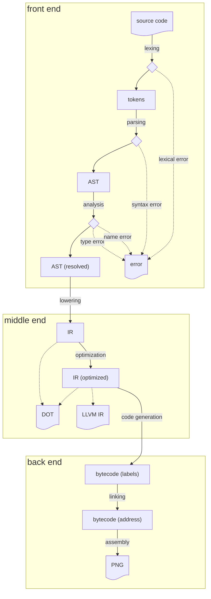

_(This document is a draft, and will be expended as development progresses.)_

## Compiler structure

The code is segmented in several stages, and mirrors the structure of a proper compiler.

Each stage has a corresponding file in `Lang/Pietre/Stages`, and each representation has a corresponding file in `Lang/Pietre/Representations`.

## Main path

### Lexing and parsing

Lexing and parsing are done with [Alex](https://haskell-alex.readthedocs.io/en/latest/index.html) and [Happy](https://haskell-happy.readthedocs.io/en/latest/index.html), that are similar to [Lex](https://en.wikipedia.org/wiki/Lex_(software)) and [Yacc](https://en.wikipedia.org/wiki/Yacc) respectively.

We use Happy's capability to [thread the lexer](https://haskell-happy.readthedocs.io/en/latest/using.html#threaded-lexers), the benefit of which is that both stages are performed at the same time: instead of first using the lexer to transform the source code into a series of [tokens](/lib/Lang/Pietre/Representations/Tokens.hs), and then feed it to the parser, we call the [parser](/lib/Lang/Pietre/Stages/Parsing/Parser.y) and let it call the [lexer](/lib/Lang/Pietre/Stages/Parsing/Lexer.x) as needed.

At the end of those two phases is the [AST](/lib/Lang/Pietre/Representations/AST.hs), the Abstract Syntax Tree. In this form, symbols are _unresolved_: all paths, be they import statements or path expressions are left untouched, and simple strings.

### Semantic analysis

We then go through the AST to do [semantic analysis](/lib/Lang/Pietre/Stages/Analysis.hs) of the parsed program. This includes:
  - validating language requirements that are not expressed in the grammar (such as restrictions on _lvalues_),
  - resolving the name of all symbols,
  - checking the type of expressions,
  - performing some control flow analysis.

Upon success, the output of this phase is another version of the AST, but altered to reflect the result of the analysis.

### Lowering

From this, we move on to the [IR](/lib/Lang/Pietre/Representations/IR.hs): a very simplified representation of the code, much easier to deal with. We use a [SSA form](https://en.wikipedia.org/wiki/Static_single-assignment_form) for the IR. To [lower](/lib/Lang/Pietre/Stages/Lowering.hs) the AST into a SSA form, we'll adapt the algorithm presented in [_Simple and Efficient Construction of Static Single Assignment Form_](https://c9x.me/compile/bib/braun13cc.pdf)[^1], with one difference: we'll use [block arguments](https://en.wikipedia.org/wiki/Static_single-assignment_form#Block_arguments) instead of Φ functions.

### Optimization

Some optimizations are performed as part of the lowering stage, such as obvious cases of dead-code analysis and constant propagation. We can however perform [further optimizations](/lib/Lang/Pietre/Stages/Optimization.hs) on the IR, such as: (TODO: detail which optimizations we perform once we perform them).

### Code generation

From the optimized IR, we can then [generate](/lib/Lang/Pietre/Stages/Generation.hs) [bytecode](/lib/Lang/Pietre/Representations/Bytecode.hs): a representation that corresponds directly to Piet's logic, with one opcode per Piet opcode plus some extra "control" ones for our structure.

This is where a real compiler would do _register allocation_: doing complex analysis to decide how each function should best store values throughout the execution. The goal is to use registers as much as possible, and to avoid "spilling", which is the need to store variables in memory, like on the stack. We do not have to do any of that complicated stuff, since our output is Piet, and everything is going on the Piet stack.

At that point, we haven't yet assigned an "address" to each function and label, so all jump opcodes (be they function calls or loops) are represented with a label name.

### Linking

The name "linking" is a slight misnomer, but we perform something very similar to what an actual linker does: to generate an image, we are going to decide how to arrange the functions within the image, and assign an address to each place the program can jump. This [linking process](/lib/Lang/Pietre/Stages/Linking.hs) outputs a copy of the bytecode, in which all the addresses have been assigned.

### Assembly

Finally, at long last, we have our resolved bytecode, and we can generate an image by translating each opcode into Piet pixels. The output of all this is, at last, our PNG image. See the [image structure](#image-structure) section for more information.

## Alternative paths

The main path described above generates an image from the source Piètre files, but we also have some alternate optional paths.

### DOT generation

For debugging purposes, the IR can be exported to a DOT graph, either before or after optimization.

### LLVM IR generation

As a bonus goal, we aim to also translate our IR into the LLVM IR, allowing for our code to be compiled into an *actual* binary. This would be an interesting exercise, and would also provide a way to compare our implementation.

## Image structure

One of the difficulties in working with Piet is the fact that the instruction pointer is *four-dimensional*. At any point, the interpreter knows our coordinates in the image, the direction in which we're moving, and whether we should check the leftmost extremity of the next "codel" edge, or the rightmost one. A program must therefore be constructed by taking those constraints into account. A reliable approach is to define "snippets", basic structures that can easily be replicated. For instance, consider the following program: it prompts for a number *n*, and prints the *n*th element of the fibonacci sequence.

It showcases some techniques we will employ when building our programs. The rest of this section is dedicated to documenting those building blocks, to document the gist of our approach.

### Global address and GOTO

Each function, and each label within each function, is assigned a unique integer value, with `main` starting at address 0 in this example. The program starts by pushing a 0 on the stack and navigating to `main`, using the "main bus" that circumnavigates the image. At the top of the image is a line that checks that the current address on top of the stack belongs to the next function.

This small set of instructions checks whether the top value of the stack is smaller than 2, as the corresponding function has two labels. The result of this comparison is a 0 or 1 value on top of the stack, above the address. We then execute a `pointer` instruction, which pops our top value, and rotates the _Direction Pointer_ clockwise by the popped amount, which is either 0 or 1; meaning that if the current address is within the function, we will rotate to start heading below the yellow pixels, and otherwise we will continue on the same line to test the next function.

To make a function call, a function pushes a return address to the stack, then pushes the arguments to the function, then finally pushes the address of the function it wishes to call, and then redirects the execution towards the main bus. A `return` instruction from a function simply brings the return address to the top of the stack and returns to the main bus.

### Function structure

Functions do not need a lot of the space: since all instructions but one only require codels of size 1, it's possible to fit a function in only two columns of instructions, between two delineating black columns, themselves surrounded by the auxiliary buses that connect to and from the main bus.

Function entrances use a similar structure to the function selection on the main bus, albeit simpler. The structure in our sample program uses this loop shape, to avoid having to manipulate direction pointer manually, while also allowing the flow of the function to cross the entrance block without it resulting in any instruction being executed.

Function exits do a very similar loop-de-loop to insert themselves in the exit bus.

### Conditional jumps

Another structure this example demonstrate is a conditional jump, specifically a "jump if zero". To do this, the function first executes a `not` instruction, to invert the condition and to make sure it's a 0 or 1 value. It then pushes to the stack the address to which it should jump, uses a roll instruction to bring the conditional value to the top, and then executes a `switch` instruction. If the condition value is 1 (meaning the original value before the `not` was indeed zero), the _Codel Chooser_ switches from left to right, meaning we select the codel of the right, while otherwise we continue through the code on the left.

### Ending

To stop the execution, we need to "trap" the instruction pointer. Specifically, we need to find a structure in which, for all four directions of the _Direction Pointer_, for each value of the _Codel Chooser_, there is nowhere to go, like in this snippet.

[^1]: By Matthias Braun, Sebastian Buchwald, Sebastian Hack, Roland Leißa, Christoph Mallon, and Andreas Zwinkau.
