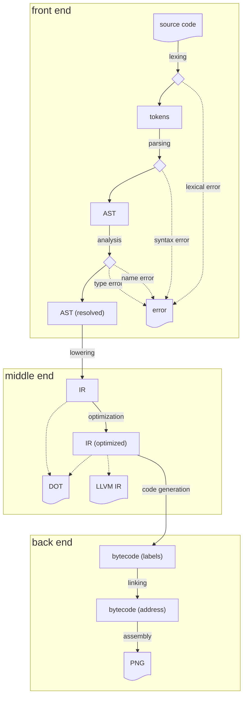

_(This document is a draft, and will be expended as development progresses.)_

## Compiler structure

The code is segmented in several stages, that resemble the stages of an actual compiler for a real language.

```mermaid
flowchart TD
    subgraph fe ["<span style="font-size: 18pt; padding-right: 400px">front&nbspend</span>"]
        s@{shape: doc, label: "source code"}
        e@{shape: doc, label: "error"}
        lexing@{shape: diamond, label: " "}
        parsing@{shape: diamond, label: " "}
        analysis@{shape: diamond, label: " "}
        t1["tokens"]
        a1["AST"]
        a2["AST (resolved)"]

        s -- lexing --> lexing
        lexing --> t1
        t1 -- parsing --> parsing --> a1
        a1 -- analysis --> analysis --> a2

        lexing -. "lexical error" .-> e
        parsing -. "syntax error" .-> e
        analysis -. "type error" .-> e
        analysis -. "name error" .-> e
    end

    subgraph me ["<span style="font-size: 18pt; padding-right: 400px">middle&nbspend</span>"]
        l@{shape: doc, label: "LLVM IR"}
        d@{shape: doc, label: "DOT"}
        i1["IR"]
        i2["IR (optimized)"]

        i1 -.-> d
        i2 -.-> d
        i2 -.-> l
        a2 -- lowering --> i1 -- optimization --> i2
    end

    subgraph be ["<span style="font-size: 18pt; padding-right: 400px">back&nbspend</span>"]
        p@{shape: doc, label: "PNG"}
        b1["bytecode (labels)"]
        b2["bytecode (address)"]
        i2 -- "code generation" --> b1
        b1 -- linking --> b2
        b2 -- assembly --> p
    end

    l ~~~ b1
```

Each stage has a corresponding file in `Lang/Pietre/Stages`, and each representation has a corresponding file in `Lang/Pietre/Representations`.

## Main path

### Lexing and parsing

Lexing and parsing are done with [Alex](https://haskell-alex.readthedocs.io/en/latest/index.html) and [Happy](https://haskell-happy.readthedocs.io/en/latest/index.html), that are similar to [Lex](https://en.wikipedia.org/wiki/Lex_(software)) and [Yacc](https://en.wikipedia.org/wiki/Yacc) respectively.

We use Happy's capability to [thread the lexer](https://haskell-happy.readthedocs.io/en/latest/using.html#threaded-lexers), the benefit of which is that both stages are performed at the same time: instead of first using the lexer to transform the source code into a series of [tokens](/lib/Lang/Pietre/Representations/Tokens.hs), and then feed it to the parser, we call the [parser](/lib/Lang/Pietre/Stages/Parsing/Parser.y) and let it call the [lexer](/lib/Lang/Pietre/Stages/Parsing/Lexer.x) as needed.

At the end of those two phases is the [AST](/lib/Lang/Pietre/Representations/AST.hs), the Abstract Syntax Tree. In this form, symbols are _unresolved_: all paths, be they import statements or path expressions are left untouched, and simple strings.

### Semantic analysis

We then go through the AST to do [semantic analysis](/lib/Lang/Pietre/Stages/Analysis.hs) of the parsed program. This includes:
  - validating language requirements that are not expressed in the grammar (such as restrictions on _rvalues_),
  - resolving the name of all symbols,
  - checking the type of expressions,
  - performing some control flow analysis.

Upon success, the output of this phase is another version of the AST, but altered to reflect the result of the analysis.

### Lowering

From this, we move on to the [IR](/lib/Lang/Pietre/Representations/IR.hs): a very simplified representation of the code, much easier to deal with. We use a [SSA form](https://en.wikipedia.org/wiki/Static_single-assignment_form) for the IR. To [lower](/lib/Lang/Pietre/Stages/Lowering.hs) the AST into a SSA form, we'll adapt the algorithm presented in [_Simple and Efficient Construction of Static Single Assignment Form_](https://c9x.me/compile/bib/braun13cc.pdf)[^1], with one difference: we'll use [block arguments](https://en.wikipedia.org/wiki/Static_single-assignment_form#Block_arguments) instead of Φ functions.

### Optimization

Some optimizations are performed as part of the lowering stage, such as obvious cases of dead-code analysis and constant propagation. We can however perform [further optimizations](/lib/Lang/Pietre/Stages/Optimization.hs) on the IR, such as TODO.

### Code generation

From the optimized IR, we can then [generate](/lib/Lang/Pietre/Stages/Generation.hs) [bytecode](/lib/Lang/Pietre/Representations/Bytecode.hs): a representation that corresponds directly to Piet's logic, with one opcode per Piet opcode plus some extra "control" ones for our structure.

This is where a real compiler would do _register allocation_: doing complex analysis to decide how each function should best store values throughout the execution. The goal is to use registers as much as possible, and to avoid "spilling", which is the need to store variables in memory, like on the stack. We do not have to do any of that complicated stuff, since our output is Piet, and everything is going on the Piet stack.

At that point, we haven't yet assigned an "address" to each function and label, so all jump opcodes (be they function calls or loops) are represented with a label name.

### Linking

The name "linking" is a slight misnomer, but we perform something very similar to what an actual linker does: to generate an image, we are going to decide how to arrange the functions within the image, and assign an address to each place the program can jump. This ["linkin" process](/lib/Lang/Pietre/Stages/Linking.hs) outputs a copy of the bytecode, in which all the addresses have been assigned.

### Assembly

Finally, at long last, we have our resolved bytecode, and we can generate an image by translating each opcode into Piet pixels. The output of all this is, at last, our PNG image. See the [image structure](#image_structure) section for more information.

## Alternative paths

The main path described above generates an image from the source Piètre files, but we also have some alternate optional paths.

### DOT generation

For debugging purposes, the IR can be exported to a DOT graph, either before or after optimization.

### LLVM IR generation

As a bonus goal, we aim to also translate our IR into the LLVM IR, allowing for our code to be compiled into an *actual* binary. This would be an interesting exercise, and would also provide a way to compare our implementation.

## Image structure and control flow

[^1]: By Matthias Braun, Sebastian Buchwald, Sebastian Hack, Roland Leißa, Christoph Mallon, and Andreas Zwinkau.
