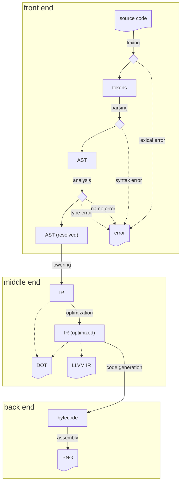

# Code organization

The code is segmented in several stages, that resemble the stages of a real compiler. Each stage has a corresponding file in `Lang/Pietre/Stages`, and each representation has a corresponding file in `Lang/Pietre/Representations`.

```mermaid
flowchart TD
    subgraph fe ["<span style="font-size: 18pt; padding-right: 400px">front&nbspend</span>"]
        s@{shape: doc, label: "source code"}
        e@{shape: doc, label: "error"}
        lexing@{shape: diamond, label: " "}
        parsing@{shape: diamond, label: " "}
        analysis@{shape: diamond, label: " "}
        t1["tokens"]
        a1["AST"]
        a2["AST (resolved)"]

        s -- lexing --> lexing
        lexing --> t1
        t1 -- parsing --> parsing --> a1
        a1 -- analysis --> analysis --> a2

        lexing -. "lexical error" .-> e
        parsing -. "syntax error" .-> e
        analysis -. "type error" .-> e
        analysis -. "name error" .-> e
    end

    subgraph me ["<span style="font-size: 18pt; padding-right: 400px">middle&nbspend</span>"]
        l@{shape: doc, label: "LLVM IR"}
        d@{shape: doc, label: "DOT"}
        i1["IR"]
        i2["IR (optimized)"]

        i1 -.-> d
        i2 -.-> d
        i2 -.-> l
        a2 -- lowering --> i1 -- optimization --> i2
    end

    subgraph be ["<span style="font-size: 18pt; padding-right: 400px">back&nbspend</span>"]
        p@{shape: doc, label: "PNG"}
        b1["bytecode"]
        i2 -- "code generation" --> b1
        b1 -- assembly --> p
    end

    d ~~~ b1
```

# Lexing and parsing
