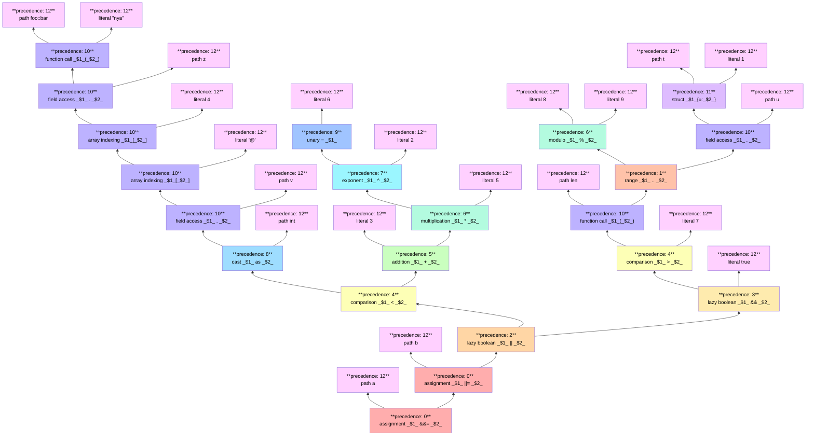

**VERSION: draft**

# Overview

This document provides a reference for the language, both its syntax and semantics.

## Versioning

Until a first version of the language is published, this document will be considered a draft, subject to breaking changes without any notice. Proper versioning will start once a "1.0.0" version of the project is released.

## Acknowledgments

The structure of this document is heavily inspired by the [Rust reference](https://doc.rust-lang.org/reference/introduction.html). This toy language is almost a strict subset of Rust from a syntax perspective, while its semantics differ.

## Semantic differences with Rust

While the differences between the two languages are vast, they are mostly the consequences of Piètre being a strict subset of Rust. There are, however, a few cases where they differ in less obvious ways, such as:

- the `^` operator has a higher precedence, and is used to indicate an exponent instead of a bitwise `xor`;
- all local variables are mutable by default, the `mut` keyword doesn't exist.

# Terminology

## Undefined

This reference uses the term "UNDEFINED" to describe any part of either the compiler or the generated program that falls outside of the scope of this document. Any implementation is free to choose whichever behaviour it deems correct in such cases.

## Incomplete

This document being a draft, some areas of the language are yet to be properly defined. Whenever possible, relevant sections will indicate what's missing with the term "INCOMPLETE".

# Lexical structure

## Input

All input is assumed to be valid UTF-8. Failure to decode a UTF-8 codepoint will result in an error, and the input will be rejected.

## Whitespace

Outside of string literals, Whitespace is not significant beyond the separation of tokens. Replacing all occurrences of one or more whitespace characters in a program by a different non-empty sequence of whitespace characters does not change the meaning of the program. Whitespace is defined using the "White_Space" [Unicode character property](https://en.wikipedia.org/wiki/Unicode_character_property#Whitespace).

## Tokens

The input file is broken down by the lexer into a series of tokens. Each token can be:

- a literal
- a keyword
- an identifier
- an operator
- a delimiter

Comments are removed as part of this phase.

## Comments

After `//`, the rest of the line is ignored. Longer code blocks use the `/* ... */` syntax.

## Literals

Valid literal tokens are:

- integer literals
- character literals
- string literals

### Integers

Integer literals come in two forms: decimal and hexadecimal. Decimal literals are a non-empty sequence of digits from `0` to `9`. Hexadecimal literals are a non-empty sequence of digits from `0` to `F` prefixed by `0x`.

> UNDEFINED!<br />
> The meaning of an integer literal that does not fit in a signed 64bit integer (i.e. a literal strictly greater than 9223372036854775807) is UNDEFINED. The compiler is free to reject it, truncate it, replace it by another value, or any other behaviour it sees fit.

### Characters

A character literal is one UTF-8 codepoint, enclosed between two single quotes. The usual escapes are supported:

- `\xNN`: ASCII character
- `\uNNNN`: unicode code point
- `\n`: newline
- `\r`: carriage return
- `\t`: tab
- `\\`: backslash
- `\0`: null
- `\'`: single quote
- `\"`: double quote

Any unrecognized escape sequence will be rejected with an error.

### Strings

A string literal is a sequence of characters enclosed between two double quotes. The same escaping rules apply as for single characters, but with an additional one: if a `\` character is followed by a newline, then all following whitespace, including said newline, is skipped until either another `\` or the end of the string is encountered. This allows for multi-line strings, like so:

```
"First line \
    \and second line"
```

This is equivalent to the string `"First line and second line"`.

After escaping a newline with a backslash, encountering any other character than whitespace, a closing backslash, or the end of the string is a parse error.

Raw string literals are not supported.

## Keywords

Keywords are special identifiers to which the language ascribes special meanings, and that consequently cannot be used as identifiers. They are:

- `use`
- `as`
- `type`
- `enum`
- `struct`
- `const`
- `fn`
- `if`
- `else`
- `while`
- `for`
- `in`
- `let`
- `return`
- `continue`
- `break`
- `true`
- `false`

## Identifiers

An identifier is any non-empty combination of letters (as per the Unicode definition) and the underscore character. Numbers are allowed in identifiers except as the first character.

- `foo` is a valid identifier
- `_` is a valid identifier
- `_2x` is a valid identifier
- `名前` is a valid identifier
- `2_` isn't
- `x'` isn't
- `>>=` isn't

## Operators

Operators are one of the following:

- `;`
- `::`
- `*`
- `,`
- `=`
- `:`
- `->`
- `<`
- `>`
- `.`
- `..=`
- `..`
- `&`
- `!`
- `-`
- `+`
- `/`
- `%`
- `^`
- `==`
- `!=`
- `>=`
- `<=`
- `&&`
- `||`
- `+=`
- `-=`
- `*=`
- `/=`
- `%=`
- `^=`

## Delimiters

Delimiters are special operators that define a "bracket". The opening bracket must always match a closing bracket. The valid pairs of brackets are:

- `( )`
- `[ ]`
- `{ }`

# Grammar

The grammar is described in the accompanying [PEG grammar file](pietre.gram). This file is NOT used in the implementation, and is only provided as reference. You can visualize it as a series of flowchart in the [accompanying visualization](grammar.svg).

## File structure

A piètre file is made of a combination of *declarations*. A declaration is one of the following:

- an import declaration
- a type declaration
- a constant declaration
- a function declaration

## Declarations

### Import

An import statement brings into scope the symbols declared in the imported file. Optionally, an import can be given a name, in which case all symbols are scoped within the given name. Module names in import statements point to files, relatives to the current module's location.

```rust
use Foo::Bar::*          // imports all symbols from Foo/Bar.pi
use abc::xyz::{a, b}     // imports symbols a and b from abc/xyz.pi
use control::monad as m  // imports symbols from control/monad.pi under the namespace m
```

Name conflicts in imports do not cause an error *at time of import*.

### Type

The language allows for three kinds of type declarations: type aliases, enumerations, and records. Both records and type aliases allow for type arguments.

#### Enumerations

An enum defines the set of valid constructors for a given type, enclosed between brackets. The name of the enum is registered in the namespace as a type, and the enum's constructors as constant values. Enum constructors cannot take an argument.

```rust
enum Colour { Red | Green | Blue };
```

This example declares an enum `Colour`, with three constructors `Red`, `Green`, and `Blue`. Under the hood, an enum is represented as an integer, but offers greater type safety.

#### Records

```rust
struct Pair<A, B> {
  fst: A,
  snd: B,
}
```

TODO

#### Aliases

```rust
type HashMap<K, V> = Vec<Pair<K,V>>;
```

TODO

### Functions

Functions are introduced with the `fn` keyword. They may declare a return type, with the `->` operator. If they don't, they are assumed to return the "unit" type `()`. Functions can optionally have type arguments.

```rust
fn gcd(a: int, b: int) -> int {
  if b > a {
    return gcd(b, a);
  } else if b == 0 {
    return a;
  } else {
    return gcd(b, a % b);
  }
}

fn lookup<K, V>(map: &HashMap<K, V>, key: K) -> V {
  for elem in map {
    if elem.fst == key {
      return elem.snd;
    }
  }
  panic("lookup: key not found");
}
```

Function arguments are the only place in the language in which a type can be declared as a *reference*. Arguments declared as such are not passed by copy, but by reference, and can therefore be mutated from within the function.

A function whose return type isn't `()` must always end on a `return` statement. An exception to that rule is the special type `!void`: if an expression returns a value of type `!void`, it will always typecheck, but all code after that expression will be deemed unreachable.

## Statements

Blocks are sets of statements delineated by curly brackets. Statements can be:

- statements with a block argument:
  - an `if` statement,
  - a `while` statement,
  - a `for` statement;
- statements without a block argument, terminated by a `;`:
  - a `let` statement, introducing a new binding,
  - a `return` statement, with an optional expression argument,
  - a `continue` statement,
  - a `break` statement,
  - a raw `expression`.

### If

An `if` statement takes an expression that must evaluate to a boolean (any other type is considered a type error, there is no notion of "truthiness" of other types) and a block. The execution branches, and executes the block if and only if the expression evaluates to `true`. Optionally, if there is an `else` statement, it is executed instead when the expression evaluates to `false`.

```rust
if x < 0 {
  foo();
} else if x > 0 {
  bar();
} else {
  baz();
}
```

### While

A `while` statement similarly takes a boolean expression, and executes the associated block as long as the expression evaluates to `true`.

```rust
let done = false;
while (!done) {
  done = process_line();
}
```

### For

A `for` statement takes an identifier, an expression that evaluates to an iterable type (the only one being the built-in type `vec`), and a block. The block is executed as many times as there are elements in the vector, which the identifier being bound successively to each element.

> UNDEFINED!<br />
> The behaviour of a `for` loop that modifies the `vec` that is being iterated on is UNDEFINED.

The loop variable is a copy of the vec item, not a reference to it: mutations of the variable are not reflected in the vector.

```rust
let input = read_lines("filename");

```

### Let

A `let` statement introduces a new variable into the scope, assigned to the associated value. A type annotation can optionally be given; if it's missing and the compiler is not able to determine the type of the variable from the expression, an error will be raised. Shadowing of an existing name is allowed, but will result in a warning.

### Return

A `return` statement interrupts the flow of the execution and immediately ends the function's execution. If the function's return type isn't `()`, the `return` statement must contain an expression of the correct type.

### Continue

A `continue` statement may only appear within the body of a loop (either `for` loop or `while` loop). The rest of the loop's block is skipped, and execution resumes from the loop's head. In the case of a while loop, the boolean condition is re-evaluated, in the case of a for loop the variable is bound to the next element. In case of several nested loops, the statement applies to the innermost loop in which it appears.

### Break

A `break` statement may only appear within the body of a loop (either `for` loop or `while` loop). The rest of the loop's block is skipped, and execution resumes after the loop.

## Expressions

An expression can be one of the following:
- a grouped expression
- a path expression
- a field access expression
- a call expression
- an array expression
- an index expression
- a struct expression
- a range expression
- a literal expression
- an operator expression

Operators, in turn, can be:
- a reference operator
- a negation operator
- an arithmetic operator
- a comparison operator
- a boolean operator
- a cast operator
- the assignent operator
- a compound assignment operator

### `lvalues` and `rvalues`

Expressions are divided into two overlapping categories: *lvalues* and *rvalues*; all expressions are rvalues, not all of them are lvalues. The `l` and `r` represent their position respective to an assignment operator: all expressions are `rvalues`, because all of them are allowed on the right-hand side of an assignment, but few of them are allowed on the left-hand side. The few expressions that can be used as `lvalues` will be flagged explicitly.

### Precedence

All expressions are evaluated in decreasing order of precedence. Associative expressions are grouped according to their associativity; for instance `1 + 2 + 3` is parsed as `(1 + 2) + 3`. The order of evaluation is as follows:

- precedence 12: grouped expressions, path expressions, array expressions, literals
- precedence 11: struct expressions
- precedence 10: function calls, field expressions, array indexing expressions, grouped left to right
- precedence 9: unary operators (`-`, `!`, `&`)
- precedence 8: `as` cast operator, grouped left to right
- precedence 7: the `^` exponentiation operator, grouped left to right
- precedence 6: operators `*`, `/`, `%`, grouped left to right
- precedence 5: operators `+`, `-`, grouped left to right
- precedence 4: comparison operators; no grouping is performed, parentheses are required
- precedence 3: `&&` boolean operator, grouped left to right
- precedence 2: `||` boolean operator, grouped left to right
- precedence 1: range expressions
- precedence 0: assignment and compound assignment operators, right to left

For instance, the following expression:

```rust
a &&= b ||= foo::bar("nya").z[4]['@'].v as int < 3 + -6 ^ 2 * 5 || len(8 % 9 .. t{u:1}.u) > 7 && true
```

Will be evaluated as if it had been grouped as follows:

```rust
(a)&&=((b)||=(((((((((foo::bar)("nya")).(z))[4])['@']).(v))as(int))<((3)+(((-6)^(2))*(5))))||((((len)(((8)%(9))..(((t){u:1}).(u))))>(7))&&(true))))
```

Or, in tree form:



### Grouped

Expressions can be wrapped between parentheses. The resulting expression evaluates to the same value as the inner expression. This can be used to control the order of evaluation.

```rust
let a =  2 + 3  * 4; // 14
let b = (2 + 3) * 4; // 20
```

### Path

A path expression points to the name of a given symbol in scope. it can be qualified with the source module path to resolve ambiguities.

```rust
use foo::bar::{a, b};
use xyz as u;
use foo::baz::{b};

fn asdhfla() {
  let v1 = a;            // resolves to foo::bar::a
  let v2 = foo::bar::a;  // resolves to foo::bar::a
  let v3 = u.a           // resolve to xyz::a
  let v4 = b             // ERROR! ambiguous name
  let v5 = foo::bar::b;  // resolves to foo::bar::b
}
```

Path expressions are valid `lvalues`, although they might be rejected if the assignment target is invalid.

###  Field access

Any expression that returns a struct can use the field access operator `.` to access an inner field of said struct.

```rust
struct Point {
  x: int,
  y: int,
}

int magnitude_sqr(p: &Point) -> int {
  return p.x * p.x + p.y * p.y;
}
```

Field access expressions are valid `lvalues`.

### Call

A path expression that points to a function can be called by supplying the arguments between parentheses. The type of the expression is the return type of the function. In the case of a function returning `()`, the return value may not be used.

### Array

An array expression is a comma separated list of values between brackets. Its type is `vec<A>` where `A` is the type of the items in the array. If the array is empty, the type of `A` will be determined from context, and an error will be raised if there isn't enough information for the compiler to determine it. Otherwise, `A` will be determined by the first element, and all further elements will be expected to be of type `A`.

```rust
let a = [1,2,3];       // vec<int>
let b = ["foo"];       // vec<str>
let c = [];            // ERROR: ambiguous type
let d: vec<int> = [];  // OK
let e = [1,'2'];       // ERROR: '2' is not an int
```

### Index

Values within a `vec` can be accessed via their index, within brackets. The expression within brackets must evaluate to an `int`.

An array indexing expression is a valid `lvalue`, but even in that case the index is considered a `rvalue`.

### Struct

A struct expression constructs a value for a given struct type. It is a path to a type name, followed by key value pairs between curly brackets.

```rust
struct Point {
  x: int,
  y: int,
}

const origin: Point = Point{x:0, y:0};
```

### Literal

A literal expression is made of one [literal token](#literals), or one of the two boolean keywords. It is a constant value.

```rust
let a = 3;
let b = '#';
let c = "foo";
let d = false;
```

### Reference

A reference expression creates a reference to a variable in scope, which can be used to call functions that expect a reference argument.

```rust
fn scale(p: &Point, s: int) {
  p.x *= s;
  p.y *= s;
}

fn main() {
  Point p = Point{x: 2, y: 3};

  scale(p, 2);   // ERROR: expecting a &Point, got a Point
  scale(&p, 2);  // OK
}
```

### Negation

Two unary negation operators exist: `!` that performs a negation on booleans, and `-` that performs a negation on integers.

### Arithmetic

Arithmetic operators are `+`, `-`, `*`, `/`, `%`, and `^`. They are only defined on integers, except for `+` which also performs concatenation on vectors and strings. Unlike in Rust, `^` is the exponent operator. It only supports positive exponents, as Piètre doesn't support floats or real numbers.

> INCOMPLETE<br />
> The way remainder works on negative values may be determined by the chosen Piet implementation. To be consistent, Piètre should choose an official Piet interpreter, and model compiler constant folding on said interpreter's implementation. Likewise, the behaviour of illegal operations, such as overflows or division by 0, are determined by the interpreter.

### Comparison

Comparison operators are `==`, `!=`, `>`, `<`, `>=`, `<=`. Most types are comparable. Enums and characters are compared by using their underlying integer representation. For vectors and strings, if they are of a different size, the longer one is deemed greater; if they are the same size, they are compared pairwise.

### Booleans

Boolean operators, `&&` and `||`, are lazy: if the left-hand side is enough to determine the result of the expression, the right-and size isn't evaluated.

```rust
x / y > 2;            // will panic if y is 0
y != 0 && x / y > 2;  // will skip the RHS if y is 0
```

### Cast

A cast expression converts the type of an expression. This is a compile-time only operation: casting is only allowed between types that share a representation. Casts that are allowed, are:

- between `int` and `char`
- between `int` and any enum value
- between `int` and `bool`
- between vectors of castable types, like `vec<char>` and `str`, or `vec<char>` and `vec<int>`

Casts are not transitive, so a cast from `str` to `vec<int>` will need to be done in two steps.

```rust
println('*' as int);  // prints 42
println(true as int); // prints 1
```

### Range

Range expressions, like array expressions, evaluate to a `vec`. Each side of the expression must evaluate to a type that can be enumerated: an `int`, a `char`, a `bool`, or any enum. The type of the array is determined by the type of the expression on the left, the type of the expression on the right is then typechecked against it. There are two variants of range expressions: `..` and `..=`: the former treats the lower bound as inclusive and the upper bound as exclusive, while the latter also treats the upper bound as inclusive.

```rust
// prints 1 to 10
fn a() {
  for x in 0..10 {
    println(x+1);
  }
}

// prints 1 to 10
fn b() {
  for x in 1..=10 {
    println(x);
  }
}
```

### Assignment

Assignment updates the value in memory pointed to by the `lvalue` with the value of the expression in the right. The only valid targets of an assignment are local variable, including function arguments.

```rust
fn by_copy(a: int) {
  a = a * 2;
  println(a);
}

fn by_ref(a: &int) {
  a = a * 2;
  println(a);
}

fn main() {
  let a = 5;
  by_copy(a); // prnts 10
  by_ref(a);  // prnts 10
  by_copy(a); // prnts 20
  by_copy(a); // prnts 20
}
```

### Compound assignment

Compound assignment operators are a convenient shortcut for modifying an `lvalue`:
```
a += b  <==>  a = a + b
a -= b  <==>  a = a - b
a *= b  <==>  a = a * b
a /= b  <==>  a = a / b
a %= b  <==>  a = a % b
a ^= b  <==>  a = a ^ b
```

# Type system

## Built-in

Built-in types are:
- `int`
- `char`
- `bool`
- `vec`
- `str`
- `()`
- `void`

### Int

`int` is an `int64`, with the assumption that the underlying Piet interpreter is able to fit it in one single stack cell.

### Char

`char` represents one unicode codepoint, and is represented with an `int` under the hood.

### Bool

Booleans are equivalent to the following enum.

```rust
enum bool{false, true}
```

### Str

`str` represents a string, and is an alias for `vec<char>`.

### Vec

`vec` is a dynamically-sized array. Since Piet does not have a notion of a heap, arrays are directly stored on the stack. They are represented as `n+1` cells, the first one being the array's length. Due to this, passing vectors by copy is fairly inefficient.

### Special types

`()` and `!void` are special types that can't be used by users. They are equivalent, respectively, to an enum with only one constructor, and to an enum with no constructor at all. `()` is the type returned by functions that do not specify a return value. No expression or statement allows for the use of values of this type. Since there are no possible values of type `!void`, this type only appears in language constructs that want to indicate unreachable code, such as the built-in `panic` function.

## User defined

### Enum

Enums are represented as a single-cell `int` on the stack as well.

### Struct

A struct is represented as all of its fields, in order, directly on the stack. Since there are no pointers, the size of a given struct value is potentially dynamic, and is the sum of the size of its fields.
